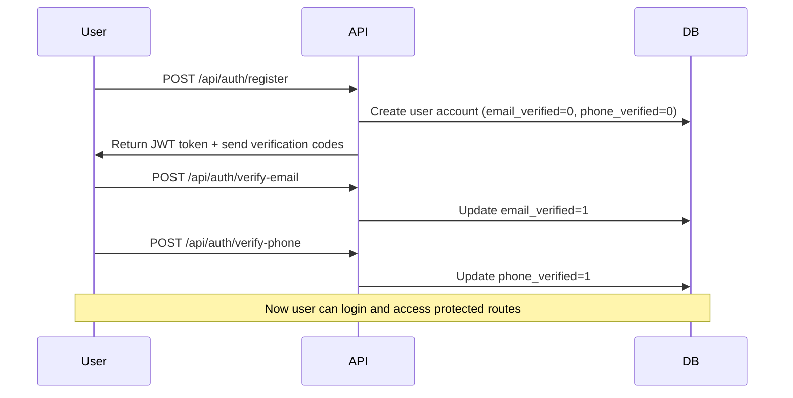
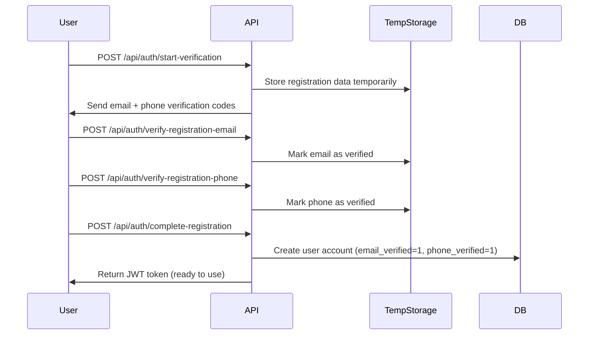

# Account Creation and Verification Flow Analysis

## Summary: **Accounts are created FIRST, then verification happens LATER**

After carefully reviewing all files in the `src` folder, here's the definitive answer about the account creation and verification flow:

## Two Registration Methods Available

### 1. **LEGACY/DEPRECATED Method** (`POST /api/auth/register`)
- **Creates account FIRST** with `email_verified = 0` and `phone_verified = 0`
- **Verification happens AFTER** account creation
- Users get a JWT token immediately but **CANNOT LOGIN** until both email and phone are verified

### 2. **NEW/PREFERRED Method** (Verification-First Process)
- **Verification happens FIRST** before account creation
- Only creates account **AFTER** both email and phone are verified
- Account is created with `email_verified = 1` and `phone_verified = 1`

## Detailed Flow Analysis

### Legacy Registration Flow (Still Available)



### New Registration Flow (Verification-First)



## Key Findings

### 1. **Login Requirements**
```javascript
// From auth.js lines 579-595
if (!user.email_verified || !user.phone_verified) {
    return res.status(403).json({
        success: false,
        error: 'Account verification required',
        message: 'You must verify both your email and phone number before logging in.'
    });
}
```

**Users CANNOT login until BOTH email AND phone are verified.**

### 2. **API Route Protection Levels**

From `server.js`:
```javascript
app.use('/api/profile', authMiddleware, requireEmailVerification, profileRoutes);
app.use('/api/pets', authMiddleware, requireFullVerification, petsRoutes);
app.use('/api/diet', authMiddleware, requireFullVerification, dietRoutes);
app.use('/api/activity', authMiddleware, requireFullVerification, activityRoutes);
app.use('/api/pet-schedule', authMiddleware, requireFullVerification, petScheduleRoutes);
app.use('/api/bookings', authMiddleware, requireFullVerification, bookingsRoutes);
app.use('/api/reviews', authMiddleware, requireFullVerification, reviewsRoutes);
app.use('/api/reports', authMiddleware, requireFullVerification, reportsRoutes);
```

- **Profile**: Requires only email verification
- **Most features**: Require FULL verification (email + phone)

### 3. **Database Schema Supports Both Flows**

From `Database_sqlite.js`:
```sql
CREATE TABLE users (
    userid INTEGER PRIMARY KEY AUTOINCREMENT,
    name TEXT NOT NULL,
    email TEXT NOT NULL UNIQUE,
    password TEXT NOT NULL,
    gender TEXT CHECK(gender IN ('Male', 'Female', 'Other')),
    role TEXT CHECK(role IN ('Pet owner', 'Service provider', 'Manager')),
    email_verified INTEGER DEFAULT 0 CHECK(email_verified IN (0, 1)),
    phone_verified INTEGER DEFAULT 0 CHECK(phone_verified IN (0, 1)),
    created_at DATETIME DEFAULT CURRENT_TIMESTAMP
);
```

The `email_verified` and `phone_verified` flags support both flows.

## Verification Middleware Analysis

### 1. **requireEmailVerification**
- Blocks access if `email_verified = 0`
- Used for profile routes

### 2. **requireFullVerification**
- Blocks access if `email_verified = 0` OR `phone_verified = 0`
- Used for most application features

## Answer to Your Question

**Both approaches are possible:**

1. ✅ **Account can be created FIRST, then verification happens LATER** (Legacy method)
   - Account exists in database with verification flags set to 0
   - User gets JWT token but cannot login until verified
   - User can verify email and phone after account creation

2. ✅ **Verification can happen FIRST, then account is created** (New method)
   - Registration data stored temporarily
   - Account only created after full verification
   - User gets JWT token and can immediately access all features

## Current System State

The system currently supports **BOTH** methods:

- **Legacy endpoint**: `POST /api/auth/register` (deprecated but functional)
- **New endpoints**: Verification-first process with multiple steps

The **new verification-first method is preferred** because:
- Better security (no unverified accounts in database)
- Better user experience (account is fully ready when created)
- Prevents accumulation of unverified accounts

## Recommendation

The current implementation is **robust and flexible**, supporting both verification flows while encouraging the use of the more secure verification-first approach.
